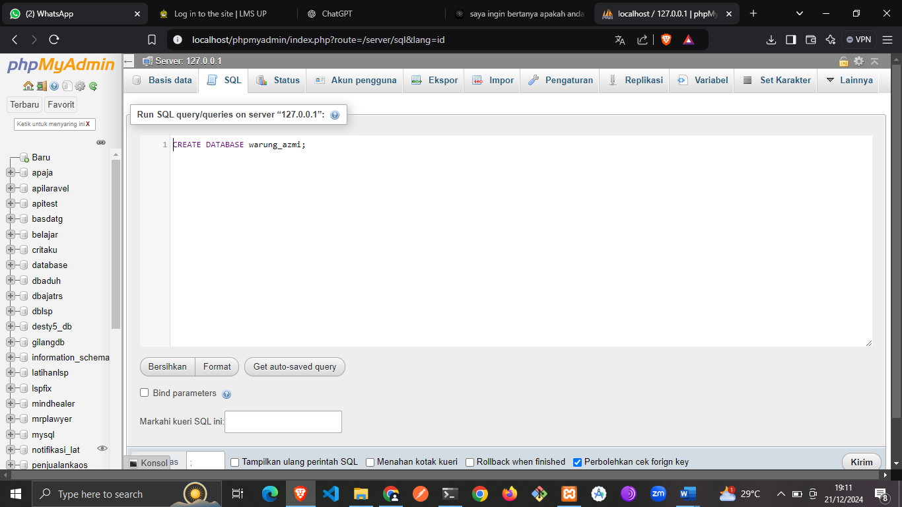

# Warung_sembako_azmi

projek uas basdat, membuat database berdasarkan implementasi pada situasi nyata. Contohnya warung sembako yang akan mengimplementasikannya menjadi relasi-relasi terkait entitas dalam tabel di database. Berikut step by step nya :

membuat database warung sembako azmi

```bash
  CREATE DATABASE warung_azmi
```


